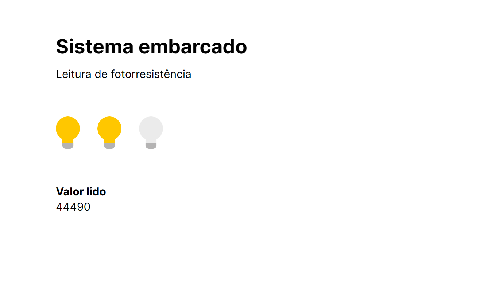
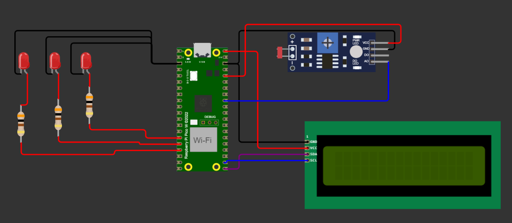

# Implementação de um Sistema de Comunicação Entre Computador e Sistema Embarcado

## Autores

Elias Biondo e Giovana Thomé  
Instituto de Tecnologia e Liderança



## Resumo

O presente estudo foca na implementação de um sistema de comunicação entre um computador e o sistema embarcado Raspberry Pi Pico W, utilizando a linguagem de programação MicroPython. O Raspberry Pi Pico W, uma evolução do microcontrolador Raspberry Pi Pico, destaca-se por sua conectividade Wi-Fi, ampliando as possibilidades de uso em aplicações diversas. A aplicação desenvolvida visa medir a intensidade da luz, relevante tanto para automação residencial quanto industrial. A implementação envolveu o uso de resistores, LEDs, um sensor LDR, um display LCD 16x2 I2C, e a programação em MicroPython para a coleta e exibição de dados de luminosidade. Os resultados obtidos em um ambiente controlado foram satisfatórios, e um exemplo prático do sistema operacional pode ser visualizado através de um vídeo disponibilizado online. O projeto evidencia o equilíbrio entre simplicidade e funcionalidade proporcionado pelo MicroPython, ressaltando o potencial de expansão e integração do sistema desenvolvido com outras plataformas e dispositivos. Por fim, a adição do display LCD I2C demonstra a facilidade de expansão do sistema para incluir novas funcionalidades e interfaces de usuário.

Palavras-chave: sistema embarcado, Raspberry Pi Pico W, MicroPython, automação, medição de luz, comunicação computador-sistema.

## Schema

Representação do sistema construído:



Obs: o fotorresistor utilizado no projeto é do modelo mais simplificado, porém o modelo utilizado não estava disponível no Wokwi (ferramenta utilizada para desenhar o schematic).

## Vídeo demonstrativo

Para visualizar o exemplo prático da aplicação em funcionamento, acesse o vídeo no seguinte link: [Vídeo Demonstrativo](https://youtu.be/uJmmqL0uu4g).

## Referências

[1] RASPBERRY PI FOUNDATION. Raspberry Pi Pico: Documentation. Raspberry Pi Foundation, [s.d.]. Disponível em: [https://bit.ly/46VPAYe](https://bit.ly/46VPAYe). Acesso em: 17 nov. 2023.

## Estrutura de Pastas

```
.
├── README.md
├── app
│   ├── favicon.ico
│   ├── globals.css
│   ├── layout.tsx
│   └── page.tsx
├── next-env.d.ts
├── next.config.js
├── package-lock.json
├── package.json
├── postcss.config.js
├── public
│   ├── bulb-0.svg
│   └── bulb-1.svg
├── python
│   ├── main.py
│   └── simple.py
├── tailwind.config.ts
└── tsconfig.json
```

A estrutura de pastas do projeto é organizada da seguinte maneira:

- `.`: Raiz do projeto.
  - `README.md`: Arquivo Markdown contendo a documentação e descrição do projeto.
  - `app`: Diretório contendo os arquivos específicos da aplicação frontend.
    - `favicon.ico`: Ícone de favorito, mostrado nas abas do navegador.
    - `globals.css`: Arquivo CSS contendo estilos globais aplicáveis a toda a aplicação.
    - `layout.tsx`: Componente React para o layout da aplicação, possivelmente incluindo cabeçalho, rodapé, e outros elementos comuns.
    - `page.tsx`: Componente React representando uma página da aplicação.
  - `next-env.d.ts`: Arquivo de declaração de tipos para o Next.js, utilizado pelo TypeScript.
  - `next.config.js`: Arquivo de configuração do Next.js, onde é possível definir configurações personalizadas para o framework.
  - `package-lock.json`: Arquivo gerado automaticamente para qualquer operação que modifique o `node_modules` ou o `package.json`.
  - `package.json`: Arquivo contendo as dependências do projeto e scripts de execução.
  - `postcss.config.js`: Arquivo de configuração para o PostCSS, uma ferramenta de software que usa plugins JavaScript para transformar estilos CSS.
  - `public`: Diretório contendo arquivos estáticos acessíveis publicamente.
    - `bulb-0.svg`: Imagem em formato SVG representando uma lâmpada desligada.
    - `bulb-1.svg`: Imagem em formato SVG representando uma lâmpada ligada.
  - `python`: Diretório contendo os scripts em Python para o sistema embarcado.
    - `main.py`: Script principal em Python para a execução no Raspberry Pi Pico W.
    - `simple.py`: Script auxiliar em Python, contendo funções simplificadas ou auxiliares.
    - `lcd_api.py`: Script auxiliar em Python, contendo funções para a manipulação do LCD.
    - `i2c_lcd.py`: Script auxiliar em Python, contendo funções para a comunicação I2C com o display LCD.
  - `tailwind.config.ts`: Arquivo de configuração do Tailwind CSS, um framework de CSS utilitário.
  - `tsconfig.json`: Arquivo de configuração do TypeScript, definindo opções para o compilador de TypeScript.

## Interface I2C e Display LCD 16x2

### Introdução ao I2C

I2C, abreviação de Inter-Integrated Circuit, é um protocolo de comunicação serial que permite a conexão de múltiplos dispositivos de baixa velocidade, como sensores e displays, a um microcontrolador com apenas dois fios: um para dados (SDA) e outro para o relógio (SCL). Este protocolo é amplamente utilizado devido à sua simplicidade e eficiência em sistemas embarcados, permitindo a comunicação entre componentes em uma mesma placa ou em dispositivos separados de maneira sincronizada.

### Uso do Display LCD 16x2 com I2C

O display LCD 16x2 é um componente que oferece uma interface visual simples para a exibição de informações em duas linhas de 16 caracteres cada. A integração do display LCD com o Raspberry Pi Pico W, utilizando o protocolo I2C, simplifica a conexão física e a programação, já que reduz o número de pinos de GPIO necessários para controlar o display.

Para o projeto em questão, o display LCD 16x2 I2C foi utilizado para mostrar os valores de intensidade luminosa medidos pelo sensor LDR. A escolha deste tipo de display é justificada pela sua facilidade de uso, confiabilidade e boa legibilidade. Além disso, o módulo I2C integrado ao display permite uma comunicação eficiente e a possibilidade de endereçamento de múltiplos dispositivos no mesmo barramento, facilitando a expansão do sistema.

A programação em MicroPython para o controle do display LCD envolve a configuração do barramento I2C no Raspberry Pi Pico W, o envio de comandos e dados ao display e a atualização constante da exibição conforme novas leituras de luminosidade são realizadas.

A implementação deste sistema de visualização é um exemplo prático da versatilidade do Raspberry Pi Pico W e do MicroPython, mostrando como dispositivos relativamente simples podem ser combinados para criar soluções eficazes e interativas para problemas do mundo real.

### Benefícios e Desafios

O uso do display LCD 16x2 via I2C trouxe melhor visualização do status do sistema para o usuário. No entanto, também apresentou desafios, como a necessidade de entender o protocolo I2C e gerenciar corretamente o endereçamento dos dispositivos, bem como garantir a compatibilidade e a sincronização entre os dispositivos conectados ao barramento I2C.
